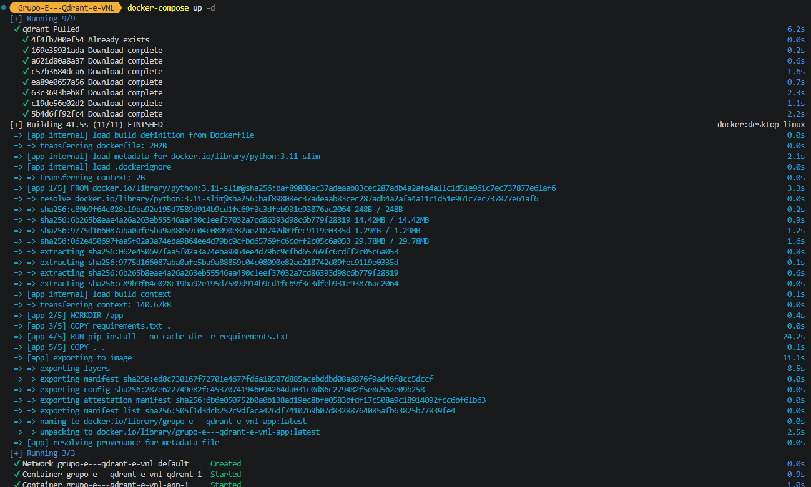
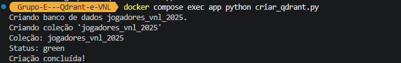
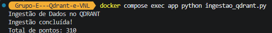
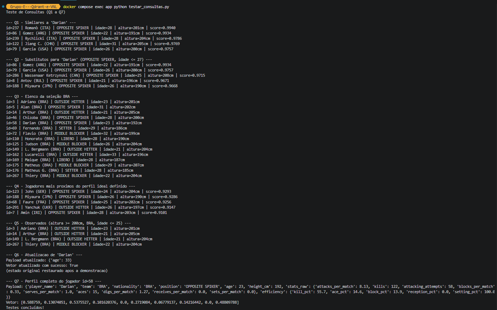
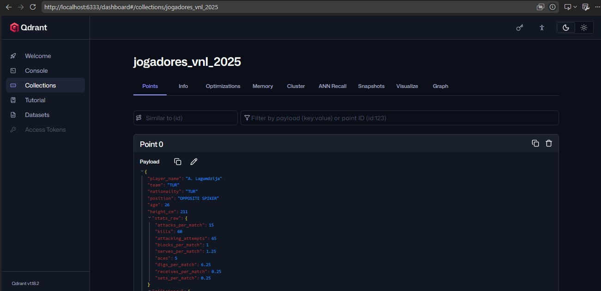
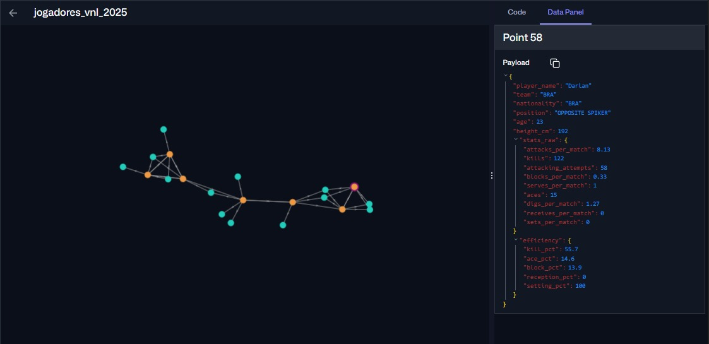

# Motor de Scouting Estatístico VNL 2025

Aplicação de scouting para a Volleyball Nations League (masculino 2025) que encontra jogadores com perfil de jogo similar usando busca vetorial no Qdrant. Cada atleta é representado por um vetor de 10 dimensões construído a partir de suas estatísticas, e os metadados (nome, seleção, posição, idade, altura) ficam no payload para filtros diretos.

---

## Como o vetor é construído (10 dimensões)

Regra uniforme: cada um dos cinco fundamentos do voleibol contribui com duas features.

| Dim | Fundamento    | Feature (pesos: 1 = volume, 0.4 = eficiência)   |
|-----|---------------|-------------------------------------------------|
| 0   | Ataque        | Attacks Per Match                               |
| 1   | Bloqueio      | Blocks Per Match                                |
| 2   | Saque         | Serves Per Match                                |
| 3   | Backcourt     | Digs + Receives Per Match                       |
| 4   | Levantamento  | Sets Per Match                                  |
| 5   | Ataque (ef.)  | Kills / (Kills + Erros + Attempts)              |
| 6   | Bloqueio (ef.)| Blocks / (Blocks + Erros + Rebounds)            |
| 7   | Saque (ef.)   | Aces / (Aces + Erros + Attempts)                |
| 8   | Recepção (ef.)| Successful Receives / Service Receptions        |
| 9   | Levant. (ef.) | Sets ok / (Sets ok + Setting Errors)            |

- Volume (peso 1) define a função do jogador (ponteiro ataca muito, líbero defende muito, levantador levanta muito) e domina a similaridade.
- Eficiência (peso 0.4) ajusta pela qualidade sem sequestrar a função.
- Cada feature é normalizada com min-max [0, 1] antes do peso.
- A coleção usa distância de Cosseno (compara o formato do perfil).
- Filtro de qualidade: jogadores com menos de 10 ações totais na competição são descartados.

---

## Estrutura do projeto

```
├── docker-compose.yml           (sobe o Qdrant local + o serviço app)
├── Dockerfile                   (imagem Python do serviço app, já com requirements.txt instalado)
├── requirements.txt             (dependências Python)
├── config_qdrant.py             (host/porta/nome da coleção, lê .env)
├── criar_qdrant.py              (cria a coleção + índices de payload)
├── ingestao_qdrant.py           (lê CSV, calcula vetores, popula o Qdrant)
├── testar_consultas.py          (executa os 7 padrões de acesso Q1-Q7)
├── ingest_vnl.py                (script auxiliar de profiling/exploração)
│
└── data/
    ├── playerStats.csv          (339 jogadores, 29 métricas - fonte)
    ├── matchStats.csv           (116 partidas)
    └── teamStats.csv            (18 times)
```

---

## Instalação e uso

Pré-requisito: apenas **Docker**. O Python e as dependências rodam dentro do container `app`, definido a partir do `Dockerfile`.

### 1. Clonar o projeto

```bash
git clone <repo-url>
cd GrupoE_RepositorioDeDadosENoSQL
```

### 2. Subir os containers (Qdrant + app)

```bash
docker compose up -d --build
```

Após a inicialização, os containers da aplicação e do Qdrant devem estar em execução.

<p align="center">
  
</p>

### 3. Criar a coleção

```bash
docker compose exec app python criar_qdrant.py
```

Após a execução, a coleção e os índices de payload serão criados no Qdrant.

<p align="center">
  
</p>

### 4. Popular com os dados

```bash
docker compose exec app python ingestao_qdrant.py
```

O script realiza a leitura do dataset, calcula os vetores e insere os jogadores na coleção.

<p align="center">
  
</p>

### 5. Rodar as consultas Q1-Q7

```bash
docker compose exec app python testar_consultas.py
```

O script executa todos os padrões de acesso implementados.

<p align="center">
  
</p>

## Visualizar no dashboard

Acesso em http://localhost:6333/dashboard.

O dashboard do Qdrant permite visualizar a coleção criada, seus vetores armazenados e os payloads associados a cada jogador.

Na aba **Collections**, é possível consultar os dados da coleção `jogadores_vnl_2025`, visualizando os dados de cada atleta armazenados no payload.

<p align="center">
  
</p>

A funcionalidade **Visualize** permite observar a distribuição dos vetores no espaço vetorial em grafos, mostrando a proximidade entre jogadores com perfis estatísticos semelhantes.

<p align="center">
  
</p>

---

## Padrões de acesso (Q1 a Q7)

Implementados em `testar_consultas.py`, cada um responde um requisito funcional:

| Q  | Padrão de acesso                               | Como funciona                           |
|----|------------------------------------------------|-----------------------------------------|
| Q1 | Busca vetorial pura                            | jogadores similares a um dado (cosseno) |
| Q2 | Busca vetorial + filtro de payload             | substituto por posição e idade máxima   |
| Q3 | Filtro puro de payload                         | lista elenco completo de uma seleção    |
| Q4 | Busca vetorial com vetor sintético             | mais próximos de um "perfil ideal"      |
| Q5 | Filtro múltiplo de payload                     | altura mínima x nacionalidade x idade   |
| Q6 | Upsert                                         | atualiza vetor/payload de um jogador    |
| Q7 | Lookup direto por id                           | perfil completo de um jogador pelo id   |

> Q6 no script de teste salva o estado original e o restaura ao final, para não corromper a base entre execuções.

---

## Tecnologia

| Componente | Tecnologia                      |
|------------|---------------------------------|
| ETL        | Python (pandas, numpy)          |
| Vector DB  | Qdrant (Docker)                 |
| Cliente    | qdrant-client                   |
| Ambiente   | Docker Compose (Qdrant + app)   |

---

## Descrição do payload
```
{
  "player_name": "Nome do jogador",
  "team": "Sigla ou nome da equipe do jogador",
  "nationality": "Nacionalidade do jogador",
  "position": "Posição em que o jogador atua",
  "age": "Idade do jogador em anos",
  "height_cm": "Altura do jogador em centímetros",

  "stats_raw": {
    "attacks_per_match": "Média de ataques realizados por partida",
    "kills": "Total de ataques que resultaram em ponto",
    "attacking_attempts": "Total de tentativas de ataque",
    "blocks_per_match": "Média de bloqueios por partida",
    "serves_per_match": "Média de saques realizados por partida",
    "aces": "Total de aces (saques que resultaram diretamente em ponto)",
    "digs_per_match": "Média de defesas (digs) por partida",
    "receives_per_match": "Média de recepções por partida",
    "sets_per_match": "Média de levantamentos (sets) por partida"
  },

  "efficiency": {
    "kill_pct": "Percentual de eficiência nos ataques (kills dividido pela tentativas de ataque)",
    "ace_pct": "Percentual de eficiência nos saques (aces dividido pelos saques executados)",
    "block_pct": "Percentual de eficiência nos bloqueios (total dividio pelas tentativas)",
    "reception_pct": "Percentual de eficiência nas recepções (total dividido pelas tentativas)",
    "setting_pct": "Percentual de eficiência nos levantamentos (total divididao pelas tentativas)"
  }
}
```


## Referências

- Dataset: https://www.kaggle.com/datasets/owenhoag07/vnl-2025-mens
- Qdrant: https://qdrant.tech/
