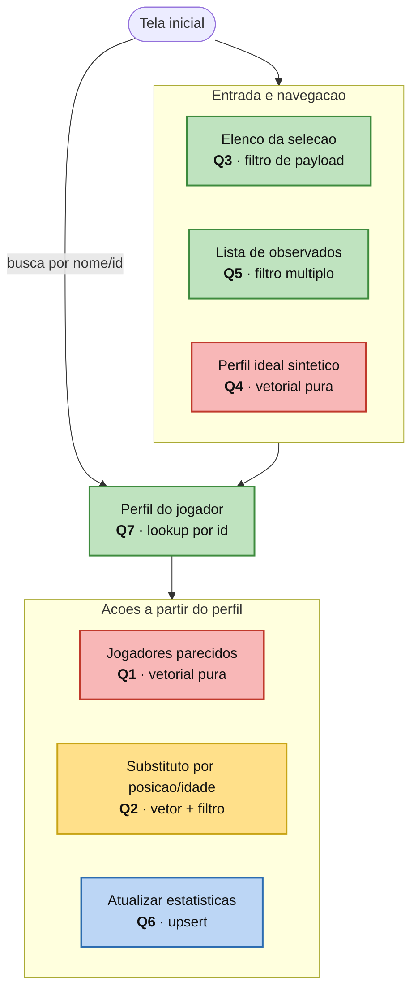

# Application Workflow Diagram — Motor de Scouting VNL 2025

> Os resultados de Q1 e Q2 reabrem um novo perfil (Q7) — o laço de navegacao
> foi omitido do desenho para manter a leitura limpa.

**Legenda**

| Cor | Tipo de acesso | Consultas |
|-----|----------------|-----------|
| 🔴 Vermelho | Busca **vetorial pura** (similaridade de cosseno, sem filtro) | Q1, Q4 |
| 🟡 Amarelo | **Híbrido**: busca vetorial **+** filtro de payload | Q2 |
| 🟢 Verde | **Sem componente vetorial**: filtro de payload ou lookup por id | Q3, Q5, Q7 |
| 🔵 Azul | **Escrita** (upsert/atualização do ponto) | Q6 |

> Particularidade Vetorial (Qdrant): Q1 e Q4 usam **similaridade vetorial pura**;
> Q2 combina vetor com filtro de payload; Q3, Q5 e Q7 são acessos **apenas por
> payload/id**, sem componente vetorial; Q6 é a operação de **escrita**.
